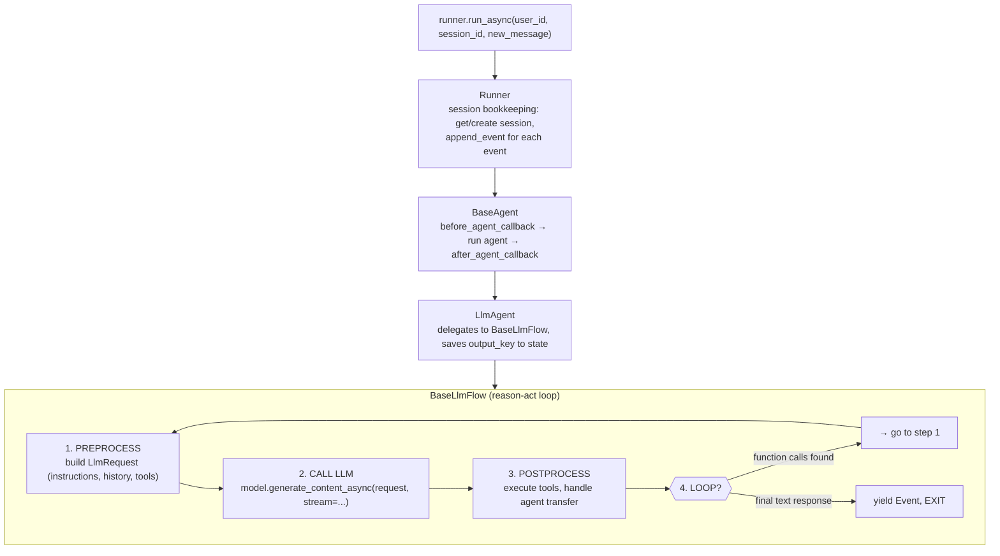
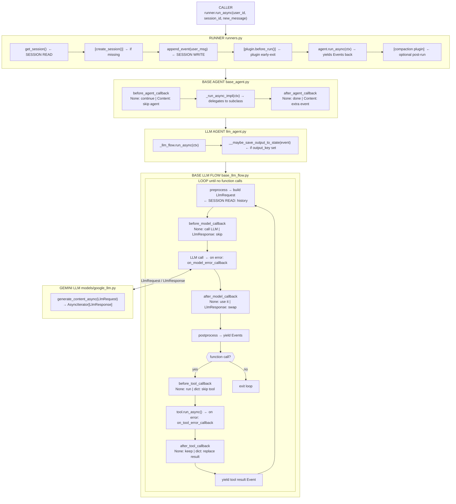
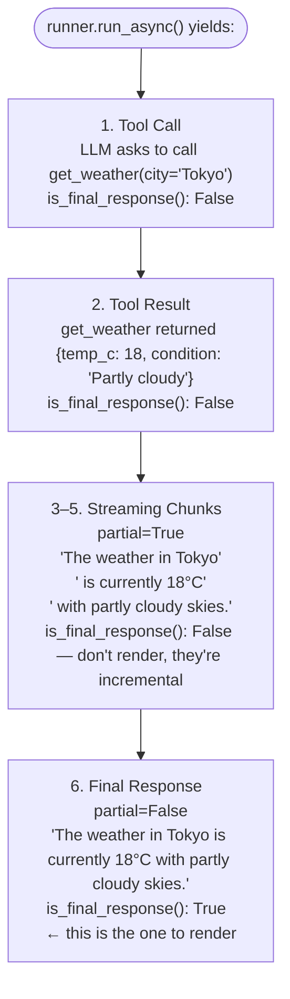
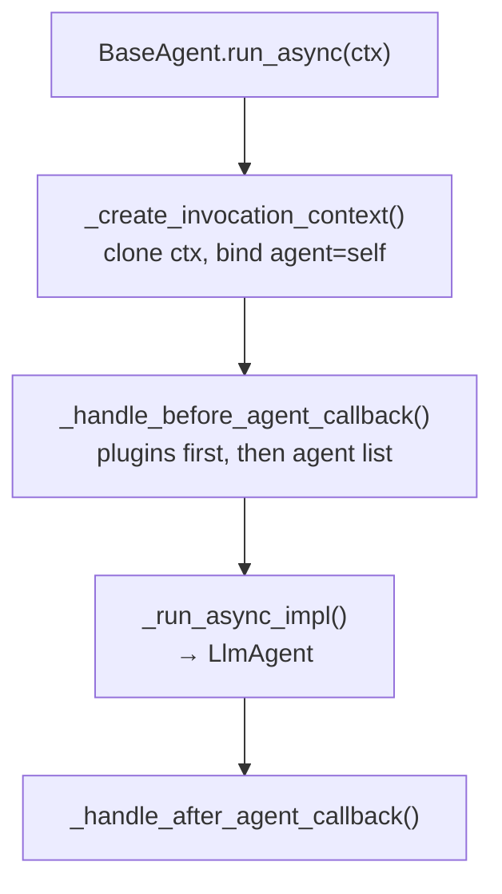
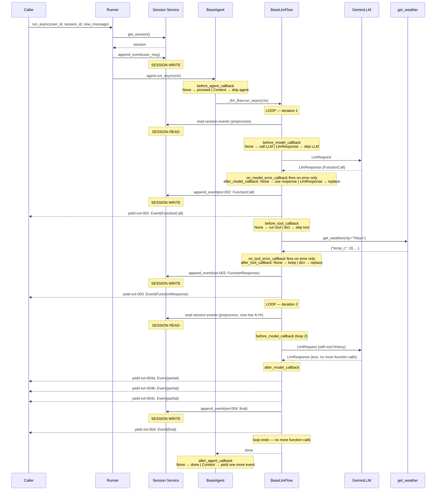

# 01 — Request-to-Response Deep-Dive Trace

> **Official docs:** [Quickstart](https://google.github.io/adk-docs/get-started/quickstart/) | **Source:** [`runners.py`](https://github.com/google/adk-python/blob/main/src/google/adk/runners.py) · [`base_agent.py`](https://github.com/google/adk-python/blob/main/src/google/adk/agents/base_agent.py) · [`llm_agent.py`](https://github.com/google/adk-python/blob/main/src/google/adk/agents/llm_agent.py) · [`base_llm_flow.py`](https://github.com/google/adk-python/blob/main/src/google/adk/flows/llm_flows/base_llm_flow.py) | **Prereqs:** [00-onboarding-guide.md](00-onboarding-guide.md)

A detailed trace of one user message through every ADK layer — from `run_async()` to the final streamed event. For setup and first agent examples, see [00-onboarding-guide.md](00-onboarding-guide.md).

## At a Glance



Trace of one user message from `run_async()` to the final streamed event. Five layers participate: Runner handles session bookkeeping (load, persist every event), BaseAgent runs before/after callbacks, LlmAgent delegates to the flow and saves `output_key` if set, BaseLlmFlow runs the reason-act loop (build request, call LLM, dispatch tools, repeat), and SessionSvc commits state atomically on every `append_event()`. The flow loops until the LLM returns no function calls. A tool-using turn typically loops 2x: tool call, then final answer.

## Key Concepts

| Concept | What It Is |
|---------|-----------|
| **Runner** | Orchestrates a request: load session → call agent → stream events → save session |
| **Session** | One conversation: event history + key-value state dict |
| **Event** | Universal data unit. Every action (user msg, LLM reply, tool call) = one Event |
| **EventActions** | Side effects on an Event: `state_delta`, `transfer_to_agent`, `escalate` |
| **Flow** | Reason-act loop inside LlmAgent: build prompt → call LLM → run tools → repeat |
| **Tool** | Python function the LLM can call. ADK auto-generates the schema |
| **ToolContext** | Runtime context passed to tools: session state, artifacts, memory, auth |
| **Callback** | Hooks on LlmAgent: before/after agent, model, tool. Return None = proceed, return value = short-circuit |
| **InvocationContext** | Thread through every call: carries session, agent, services. Cloned for sub-agents |
| **MCP** | Model Context Protocol: connect to external tool servers via `McpToolset` |

> Full glossary: [reference/glossary.md](../reference/glossary.md)

## How It Works

### Layer Diagram



### The Weather Agent

```python
from google.adk.agents import LlmAgent
from google.adk.runners import Runner
from google.adk.sessions import InMemorySessionService
from google.genai import types

def get_weather(city: str) -> dict:
    """Returns the current weather for a city."""
    return {"city": city, "temp_c": 18, "condition": "Partly cloudy"}

weather_agent = LlmAgent(
    name="weather_agent",
    model="gemini-2.5-flash",
    instruction="You are a helpful weather assistant. Use the get_weather tool when asked about weather.",
    tools=[get_weather],
)

session_service = InMemorySessionService()
runner = Runner(agent=weather_agent, app_name="weather_app", session_service=session_service)
session = await session_service.create_session(app_name="weather_app", user_id="user_42")

async for event in runner.run_async(
    user_id="user_42",
    session_id=session.id,
    new_message=types.Content(role="user", parts=[types.Part(text="What's the weather in Tokyo?")]),
):
    if event.is_final_response():
        print(event.content.parts[0].text)
```

User message: **"What's the weather in Tokyo?"**

The rest of this file traces exactly what happens inside ADK when this code runs.

### What the Caller Receives

`runner.run_async()` yields these events for the Tokyo weather query:



> The user message is appended to the session internally but never yielded to your code.

**Typical handling pattern:**

```python
async for event in runner.run_async(...):
    if event.is_final_response() and event.content:
        print(event.content.parts[0].text)
    elif event.partial and event.content:
        print(event.content.parts[0].text, end="", flush=True) # stream to UI
```

### Step-by-Step Trace

#### Step 0 — Session State Before the Request

```python
# Session loaded by get_session() — empty for a brand-new conversation
Session(
    id="sess-abc123",
    app_name="weather_app",
    user_id="user_42",
    state={}, # no persistent state yet
    events=[], # no history
)
```

#### Step 1 — Runner Entry

**Source:** [`runners.py`](https://github.com/google/adk-python/blob/main/src/google/adk/runners.py)

Runner fetches the session, persists the user message as an Event, and builds the `InvocationContext`.

**User Event (evt-001) — created and persisted before the agent runs:**

```python
Event(
    id="evt-001",
    invocation_id="e-inv-9f2a", # ties every event in this run_async() call together
    author="user",
    timestamp=1741996801.234,
    content=Content(
        role="user",
        parts=[Part(text="What's the weather in Tokyo?")]
    ),
    actions=EventActions(state_delta={}, artifact_delta={}),
)
```

**InvocationContext — passed to every layer:**

```python
InvocationContext(
    invocation_id="e-inv-9f2a",
    agent=weather_agent,
    session=session, # now has events=[evt-001]
    branch=None,
    user_content=Content(...), # the original user message
    end_invocation=False,
    session_service=InMemorySessionService(...),
    plugin_manager=PluginManager(plugins=[]),
)
```

#### Step 2 — Agent Callbacks (before_agent_callback)

**Source:** [`agents/base_agent.py`](https://github.com/google/adk-python/blob/main/src/google/adk/agents/base_agent.py)



No callbacks configured — both return `None`.

#### Step 3 — Build LlmRequest (Preprocess)

**Source:** [`flows/llm_flows/base_llm_flow.py`](https://github.com/google/adk-python/blob/main/src/google/adk/flows/llm_flows/base_llm_flow.py)

Three processors mutate `LlmRequest` in order:

1. **`instructions.py`** — injects the system prompt (substitutes `{vars}` if any)
2. **`contents.py`** — reads `session.events` filtered to the current branch — builds `contents` list
3. **`functions.py`** — converts Python tools to `FunctionDeclaration` schemas

**LlmRequest sent to the model:**

```python
LlmRequest(
    model="gemini-2.5-flash",
    contents=[
        Content(role="user", parts=[Part(text="What's the weather in Tokyo?")])
    ],
    config=GenerateContentConfig(
        system_instruction="You are a helpful weather assistant…",
        tools=[Tool(function_declarations=[
            FunctionDeclaration(
                name="get_weather",
                description="Returns the current weather for a city.",
                parameters=Schema(type="OBJECT", properties={"city": Schema(type="STRING")}, required=["city"]),
            )
        ])],
    ),
    tools_dict={"get_weather": FunctionTool(func=get_weather)},
)
```

> **`before_model_callback` fires here** — after this request is built, before the API call. Return `None` to proceed; return an `LlmResponse` to skip the LLM entirely.

#### Step 4 — LLM Call → Function Call Response

**Source:** [`models/google_llm.py`](https://github.com/google/adk-python/blob/main/src/google/adk/models/google_llm.py)

The LLM calls `get_weather`, streaming a function call chunk then the final:

```
chunk 1 (partial=True): FunctionCall(name="get_weather", args={"city": "Tokyo"})
chunk 2 (partial=False): FunctionCall(name="get_weather", args={"city": "Tokyo"})
```

> If the call raises, **`on_model_error_callback`** fires. Return `None` to re-raise; return an `LlmResponse` to suppress.
> After success, **`after_model_callback`** fires. Return `None` to use the real response; return an `LlmResponse` to replace it.

**Event #2 — yielded to Runner → persisted:**

```python
Event(
    id="evt-002",
    invocation_id="e-inv-9f2a",
    author="weather_agent",
    timestamp=1741996801.891,
    content=Content(
        role="model",
        parts=[Part(function_call=FunctionCall(id="fc-001", name="get_weather", args={"city": "Tokyo"}))]
    ),
    actions=EventActions(state_delta={}, artifact_delta={}),
    long_running_tool_ids=None,
)
# is_final_response() = False — contains a function call
```

#### Step 5 — Tool Dispatch

**Source:** [`flows/llm_flows/functions.py`](https://github.com/google/adk-python/blob/main/src/google/adk/flows/llm_flows/functions.py)

```
1. Extract FunctionCall: name="get_weather", args={"city": "Tokyo"}, id="fc-001"
2. Look up: tools_dict["get_weather"] ► FunctionTool(func=get_weather)
3. before_tool_callback ► None ► proceed
4. tool.run_async({"city": "Tokyo"}, tool_context)
   on error ► on_tool_error_callback
5. after_tool_callback ► None ► keep original result
```

**Tool result:**

```python
get_weather(city="Tokyo") # → {"city": "Tokyo", "temp_c": 18, "condition": "Partly cloudy"}
```

**Event #3 — yielded to Runner → persisted:**

```python
Event(
    id="evt-003",
    invocation_id="e-inv-9f2a",
    author="weather_agent",
    timestamp=1741996802.045,
    content=Content(
        role="user", # ← tool responses use role="user" per Gemini API convention
        parts=[Part(function_response=FunctionResponse(
            id="fc-001",
            name="get_weather",
            response={"result": {"city": "Tokyo", "temp_c": 18, "condition": "Partly cloudy"}},
        ))]
    ),
    actions=EventActions(state_delta={}, artifact_delta={}),
)
# is_final_response() = False — contains a function response
```

#### Step 6 — Rebuild LlmRequest (Loop Iteration 2)

The flow loops. Session now has 3 events. A new `LlmRequest` includes the full history:

```python
LlmRequest(
    model="gemini-2.5-flash",
    contents=[
        # Turn 1: user question
        Content(role="user", parts=[Part(text="What's the weather in Tokyo?")]),
        # Turn 2: model's tool call
        Content(role="model", parts=[Part(function_call=FunctionCall(id="fc-001", name="get_weather", args={"city": "Tokyo"}))]),
        # Turn 3: tool result
        Content(role="user", parts=[Part(function_response=FunctionResponse(id="fc-001", name="get_weather",
            response={"result": {"city": "Tokyo", "temp_c": 18, "condition": "Partly cloudy"}}))]),
    ],
    config=GenerateContentConfig(system_instruction="…", tools=[…]), # same as before
)
```

> `before_model_callback` fires again before this second LLM call.

#### Step 7 — Final LLM Response (Streaming)

The LLM streams the answer:

```
partial chunk 1: "The weather in Tokyo"
partial chunk 2: " is currently 18°C"
partial chunk 3: " with partly cloudy skies."
final chunk: "The weather in Tokyo is currently 18°C with partly cloudy skies."
```

Partial events are yielded but not persisted (no session I/O).

> `after_model_callback` fires after the final (non-partial) chunk arrives.

**Event #4 — the final authoritative event, yielded and persisted:**

```python
Event(
    id="evt-004",
    invocation_id="e-inv-9f2a",
    author="weather_agent",
    timestamp=1741996802.891,
    partial=False,
    content=Content(
        role="model",
        parts=[Part(text="The weather in Tokyo is currently 18°C with partly cloudy skies.")]
    ),
    actions=EventActions(state_delta={}), # empty — no output_key on this agent
    usage_metadata=GenerateContentResponseUsageMetadata(
        prompt_token_count=87, candidates_token_count=18, total_token_count=105
    ),
    finish_reason=FinishReason.STOP,
)
# is_final_response() = True — text only, partial=False → flow loop exits
```

#### Step 8 — Session After the Request

```python
Session(
    id="sess-abc123",
    state={}, # unchanged — no state_delta was applied in this turn
    events=[
        Event(id="evt-001", author="user", content="What's the weather in Tokyo?"),
        Event(id="evt-002", author="weather_agent", content=FunctionCall(get_weather, city=Tokyo)),
        Event(id="evt-003", author="weather_agent", content=FunctionResponse(get_weather, {temp_c:18,…})),
        Event(id="evt-004", author="weather_agent", content="The weather in Tokyo is currently 18°C…"),
    ],
)
```

### Full Sequence Diagram

All callbacks and session writes shown in order. A callback returning non-None short-circuits the step it guards.



## Gotchas

### Callbacks

Plugins run first (stop at first non-None), then agent callbacks. Each can be a function or list.

#### Signatures and Return Effects

```python
# ── AGENT ────────────────────────────────────────────────────────────────────

# Before _run_async_impl(). Non-None → skip agent entirely.
def before_agent_callback(callback_context: CallbackContext) -> Optional[types.Content]: ...

# After _run_async_impl(). Non-None → yield one more Event with that content.
def after_agent_callback(callback_context: CallbackContext) -> Optional[types.Content]: ...

# ── MODEL ────────────────────────────────────────────────────────────────────

# After LlmRequest built, before LLM call. Non-None → skip the LLM.
# llm_request may be mutated in place.
def before_model_callback(callback_context: CallbackContext, llm_request: LlmRequest) -> Optional[LlmResponse]: ...

# After LLM returns. Non-None → replace the response.
def after_model_callback(callback_context: CallbackContext, llm_response: LlmResponse) -> Optional[LlmResponse]: ...

# When LLM call raises. Non-None → suppress error, use this response.
def on_model_error_callback(callback_context: CallbackContext, llm_request: LlmRequest, error: Exception) -> Optional[LlmResponse]: ...

# ── TOOL ─────────────────────────────────────────────────────────────────────

# Before tool.run_async(). Non-None → skip tool, use dict as result.
# args may be mutated in place.
def before_tool_callback(tool: BaseTool, args: dict[str, Any], tool_context: ToolContext) -> Optional[dict]: ...

# After tool succeeds. Non-None → replace the result.
def after_tool_callback(tool: BaseTool, args: dict[str, Any], tool_context: ToolContext, tool_response: dict) -> Optional[dict]: ...

# When tool raises. Non-None → suppress error, use dict as result.
def on_tool_error_callback(tool: BaseTool, args: dict[str, Any], tool_context: ToolContext, error: Exception) -> Optional[dict]: ...
```

For a summary table of each callback's None/non-None effects, see [04-agents.md](04-agents.md).

#### Plugin-Only Callbacks

Plugins add four more hooks:

| Plugin Callback | When |
|---|---|
| `on_user_message_callback` | User message received by Runner |
| `before_run_callback` | Before agent loop starts |
| `after_run_callback` | After agent loop ends |
| `on_event_callback` | On every yielded event |

### Session Service

**Source:** [`sessions/base_session_service.py`](https://github.com/google/adk-python/blob/main/src/google/adk/sessions/base_session_service.py)

#### Session Calls Per Invocation

Runner makes one `get_session` call at start, one `append_event` for the user message, and one `append_event` per non-partial event. See [18-session-lifecycle.md](18-session-lifecycle.md) for the complete annotated timeline.

See [18-session-lifecycle.md](18-session-lifecycle.md) for the full `append_event` pseudocode and step-by-step breakdown.

#### State Key Scopes

State keys use prefixes to control scope: no prefix (session), `app:` (all users), `user:` (cross-session), `temp:` (current invocation only, never persisted). See [08-sessions.md](08-sessions.md) for the full scoping rules, persistence behavior, and code examples.

See [08-sessions.md](08-sessions.md) for the backend comparison table and [18-session-lifecycle.md](18-session-lifecycle.md) for latency and concurrency details.

### Key Invariants

| Invariant | Source |
|---|---|
| Every Event gets a unique UUID | [`event.py:model_post_init`](https://github.com/google/adk-python/blob/main/src/google/adk/events/event.py#L77) |
| `invocation_id` ties all events in one `run_async()` call | [`runners.py`](https://github.com/google/adk-python/blob/main/src/google/adk/runners.py) |
| `partial=True` events are never passed to `append_event` | [`base_session_service.py:L105`](https://github.com/google/adk-python/blob/main/src/google/adk/sessions/base_session_service.py#L105) |
| `state_delta` is applied atomically on `append_event` | [`base_session_service.py`](https://github.com/google/adk-python/blob/main/src/google/adk/sessions/base_session_service.py) |
| `temp:` keys are in-memory only — stripped from persisted delta | [`base_session_service.py:_apply_temp_state`](https://github.com/google/adk-python/blob/main/src/google/adk/sessions/base_session_service.py#L118) |
| LLM is never called directly — always through a flow | [`llm_agent.py:_run_async_impl`](https://github.com/google/adk-python/blob/main/src/google/adk/agents/llm_agent.py#L458) |
| Tool results feed into the next `LlmRequest.contents` | [`flows/llm_flows/contents.py`](https://github.com/google/adk-python/blob/main/src/google/adk/flows/llm_flows/contents.py) |
| Only `is_final_response()=True` events should be rendered | [`event.py:is_final_response`](https://github.com/google/adk-python/blob/main/src/google/adk/events/event.py#L83) |
| Callbacks: plugins first, agent list second; first non-None wins | [`base_agent.py:L434`](https://github.com/google/adk-python/blob/main/src/google/adk/agents/base_agent.py#L434) |

## Related

[`runners.py`](https://github.com/google/adk-python/blob/main/src/google/adk/runners.py) ·
[`agents/base_agent.py`](https://github.com/google/adk-python/blob/main/src/google/adk/agents/base_agent.py) ·
[`agents/llm_agent.py`](https://github.com/google/adk-python/blob/main/src/google/adk/agents/llm_agent.py) ·
[`agents/invocation_context.py`](https://github.com/google/adk-python/blob/main/src/google/adk/agents/invocation_context.py) ·
[`agents/context.py`](https://github.com/google/adk-python/blob/main/src/google/adk/agents/context.py) ·
[`agents/callback_context.py`](https://github.com/google/adk-python/blob/main/src/google/adk/agents/callback_context.py) ·
[`flows/llm_flows/base_llm_flow.py`](https://github.com/google/adk-python/blob/main/src/google/adk/flows/llm_flows/base_llm_flow.py) ·
[`flows/llm_flows/functions.py`](https://github.com/google/adk-python/blob/main/src/google/adk/flows/llm_flows/functions.py) ·
[`models/base_llm.py`](https://github.com/google/adk-python/blob/main/src/google/adk/models/base_llm.py) ·
[`models/llm_request.py`](https://github.com/google/adk-python/blob/main/src/google/adk/models/llm_request.py) ·
[`models/llm_response.py`](https://github.com/google/adk-python/blob/main/src/google/adk/models/llm_response.py) ·
[`events/event.py`](https://github.com/google/adk-python/blob/main/src/google/adk/events/event.py) ·
[`events/event_actions.py`](https://github.com/google/adk-python/blob/main/src/google/adk/events/event_actions.py) ·
[`sessions/session.py`](https://github.com/google/adk-python/blob/main/src/google/adk/sessions/session.py) ·
[`sessions/base_session_service.py`](https://github.com/google/adk-python/blob/main/src/google/adk/sessions/base_session_service.py) ·
[`sessions/state.py`](https://github.com/google/adk-python/blob/main/src/google/adk/sessions/state.py) ·
[`tools/base_tool.py`](https://github.com/google/adk-python/blob/main/src/google/adk/tools/base_tool.py) ·
[`plugins/plugin_manager.py`](https://github.com/google/adk-python/blob/main/src/google/adk/plugins/plugin_manager.py)
