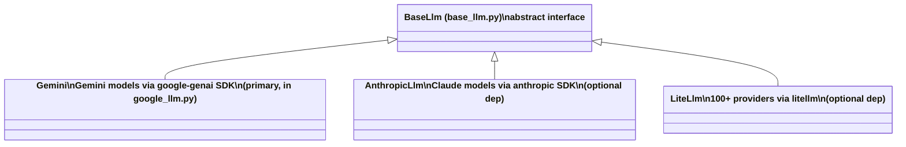
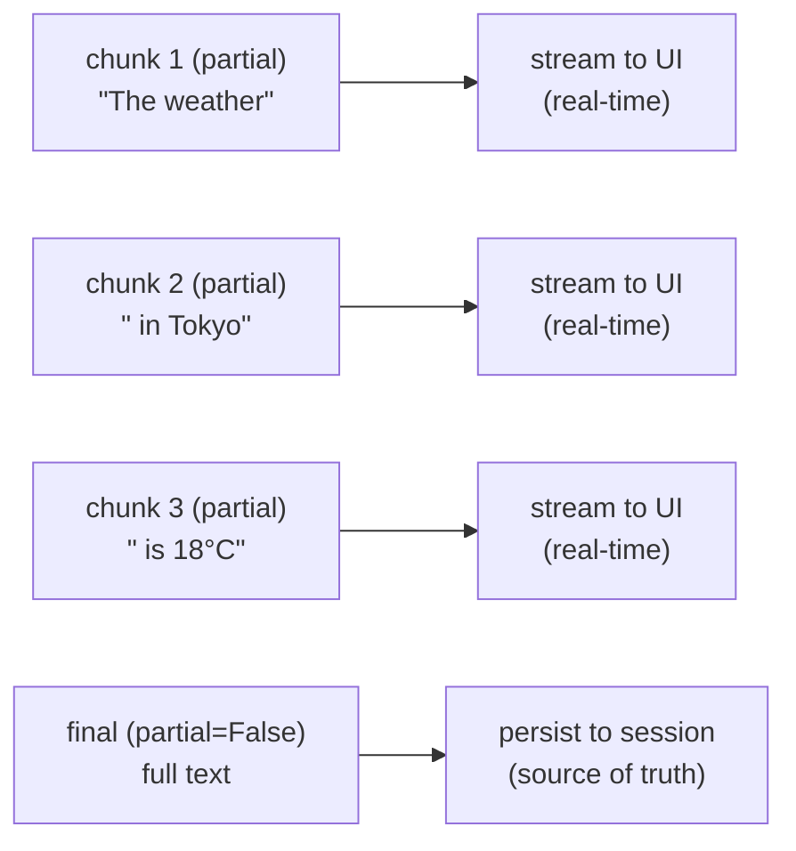
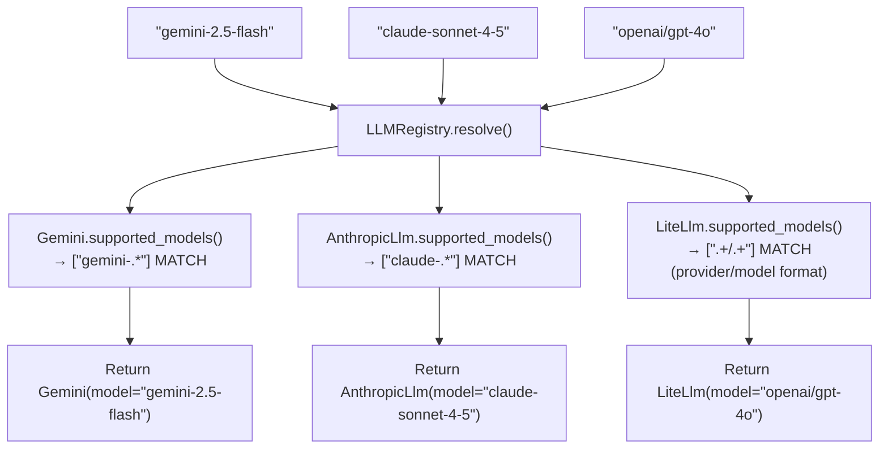

# Models — LLM Adapters

> **Official docs:** [Models](https://google.github.io/adk-docs/runtime/models/) | **Source:** [`base_llm.py`](https://github.com/google/adk-python/blob/main/src/google/adk/models/base_llm.py) · [`registry.py`](https://github.com/google/adk-python/blob/main/src/google/adk/models/registry.py) · [`llm_request.py`](https://github.com/google/adk-python/blob/main/src/google/adk/models/llm_request.py) · [`llm_response.py`](https://github.com/google/adk-python/blob/main/src/google/adk/models/llm_response.py) | **Prereqs:** [05-flows.md](05-flows.md)

---

## What It Is

Thin adapter layer between ADK's internal types (`LlmRequest`, `LlmResponse`) and LLM providers (Gemini, Anthropic, LiteLLM). Hides provider-specific calls behind a single interface.

---

## Class Hierarchy



---

## BaseLlm — The Interface

```python
class BaseLlm(BaseModel):
    model: str # e.g. 'gemini-2.5-flash', 'claude-opus-4-5'

    @classmethod
    def supported_models(cls) -> list[str]:
        # Returns regex patterns that match model names for this adapter.
        # Used by LLMRegistry to auto-select the right class.
        ...

    @abstractmethod
    async def generate_content_async(
        self,
        llm_request: LlmRequest,
        stream: bool = False,
    ) -> AsyncGenerator[LlmResponse, None]:
        # Unidirectional text/chat generation.
        # Non-streaming: yields exactly one LlmResponse (partial=False).
        # Streaming: yields N partial=True chunks, then one partial=False final.
        ...

    def connect(self, llm_request: LlmRequest) -> BaseLlmConnection:
        # Bidirectional streaming for Live API (audio/video).
        # Not all adapters support this.
        ...
```

---

## Streaming Contract

`generate_content_async` with `stream=True` yields:

```
LlmResponse(partial=True, content=[Part(text='The weather')])
LlmResponse(partial=True, content=[Part(text=' in Tokyo')])
LlmResponse(partial=True, content=[Part(text=' is sunny.')])
LlmResponse(partial=False, content=[Part(text='The weather in Tokyo is sunny.')])
```

The final `partial=False` chunk is a complete aggregation. Use it for storage; partial chunks are for streaming UI only.

Function calls, thoughts, and blobs can also arrive as partial chunks.



`partial=True` events are FREE — `append_event()` skips them.

---

## LLMRegistry — Auto-Dispatch

`LLMRegistry` maps model name strings to `BaseLlm` subclasses via regex:

```python
# Registration (done at module import time in each adapter):
LLMRegistry.register(Gemini)
# Gemini.supported_models() = [r'gemini-.*', r'learnlm-.*', ...]

# Resolution:
llm = LLMRegistry.new_llm('gemini-2.5-flash')
# → finds Gemini via regex match → returns Gemini(model='gemini-2.5-flash')
```

`resolve()` is `@lru_cache(maxsize=32)` — repeated resolution of the same model name is fast.



**Error messages are helpful:**
- `claude-*` → tells you to `pip install google-adk[extensions]`
- `provider/model` format → tells you to install `litellm`

---

## LlmRequest

The request object assembled by the flow before calling the model:

```python
class LlmRequest:
    model: str # model name to use
    contents: list[types.Content] # conversation history
    config: types.GenerateContentConfig # system_instruction, tools, temperature, safety, etc.
    tools_dict: dict[str, BaseTool] # name → BaseTool (internal routing map)
    cache_config: Optional[...] # context cache configuration
    cache_metadata: Optional[...] # context cache metadata
    cacheable_contents_token_count: int # token count for cacheable contents
    live_connect_config: Optional[...] # Live API connection config
    previous_interaction_id: Optional[str] # for resumable invocations

    # Note: system_instruction and tools live inside config (GenerateContentConfig),
    # not as top-level fields on LlmRequest.

    def append_tools(self, tools: list[BaseTool]) -> None:
        # Adds FunctionDeclarations to config.tools and populates tools_dict.
```

---

## LlmResponse

The response object returned by the model:

```python
class LlmResponse:
    content: Optional[types.Content] # text, function calls, thoughts, blobs
    partial: Optional[bool] # True = streaming chunk, False = final
    usage_metadata: ... # token counts
    grounding_metadata: ... # search grounding info
    input_transcription: ... # Live API: what user said
    output_transcription: ... # Live API: what model said
    error_code: ...
    error_message: ...
```

`Event` extends `LlmResponse`, so events carry all response fields plus `author`, `invocation_id`, `actions`, and `branch`.

---

## Default Model

```python
LlmAgent.DEFAULT_MODEL = 'gemini-2.5-flash'
```

Override globally:

```python
LlmAgent.set_default_model('gemini-2.5-pro')
```

Model inheritance: walks up `parent_agent` chain, falls back to default.

---

## Adding a Custom Adapter

```python
from google.adk.models.base_llm import BaseLlm
from google.adk.models.registry import LLMRegistry

class MyLlm(BaseLlm):
    @classmethod
    def supported_models(cls):
        return [r'my-model-.*']

    async def generate_content_async(self, llm_request, stream=False):
        # Call your API here
        yield LlmResponse(content=..., partial=False)

LLMRegistry.register(MyLlm)
# Now 'my-model-v1' will route to MyLlm
```

---

## Related

- [`models/base_llm.py`](https://github.com/google/adk-python/blob/main/src/google/adk/models/base_llm.py) — abstract interface
- [`models/registry.py`](https://github.com/google/adk-python/blob/main/src/google/adk/models/registry.py) — model dispatch
- [`models/llm_request.py`](https://github.com/google/adk-python/blob/main/src/google/adk/models/llm_request.py) — request object
- [`models/llm_response.py`](https://github.com/google/adk-python/blob/main/src/google/adk/models/llm_response.py) — response object
- [`models/google_llm.py`](https://github.com/google/adk-python/blob/main/src/google/adk/models/google_llm.py) — Gemini adapter (`class Gemini`)
- [`models/anthropic_llm.py`](https://github.com/google/adk-python/blob/main/src/google/adk/models/anthropic_llm.py) — Anthropic adapter
- [`models/lite_llm.py`](https://github.com/google/adk-python/blob/main/src/google/adk/models/lite_llm.py) — LiteLLM adapter
