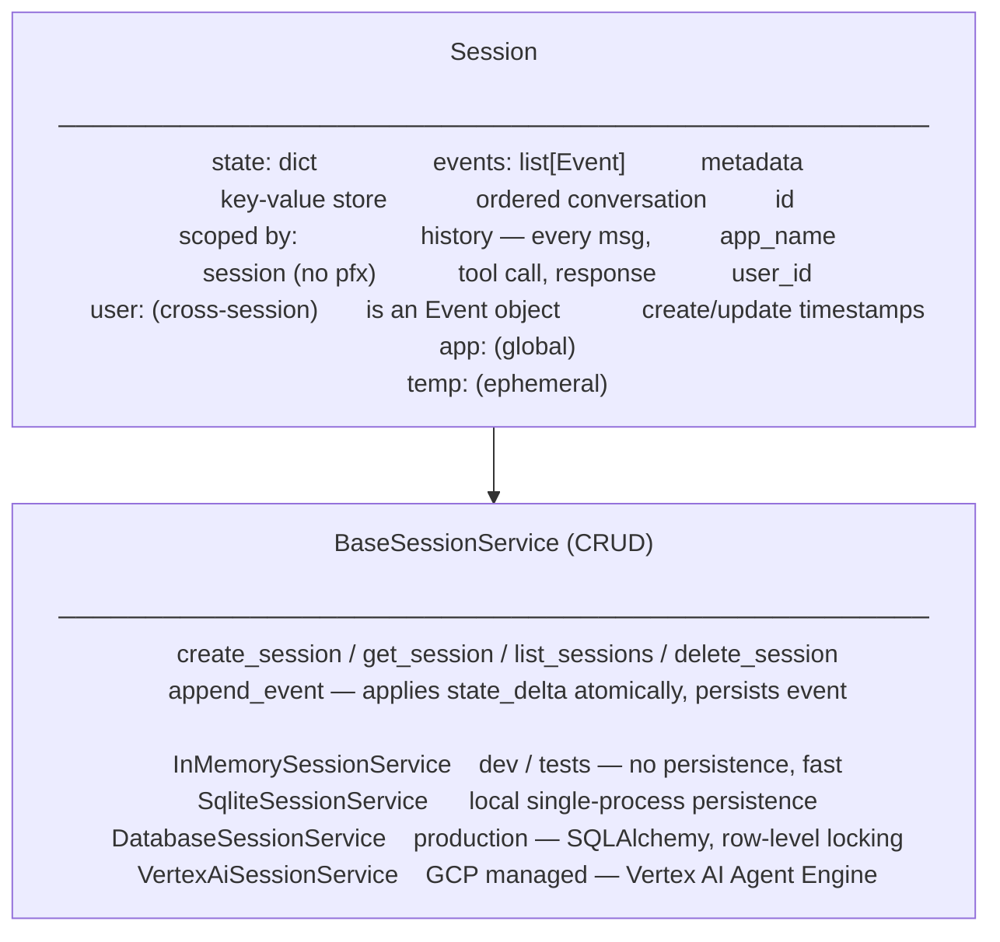
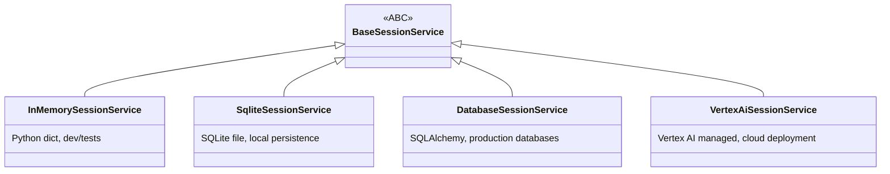
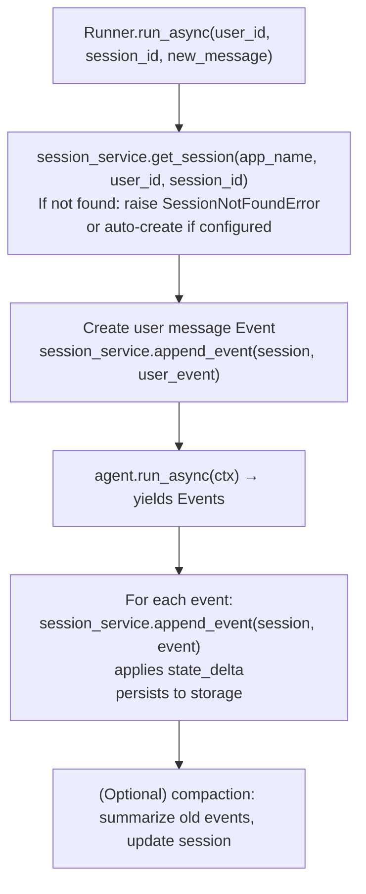
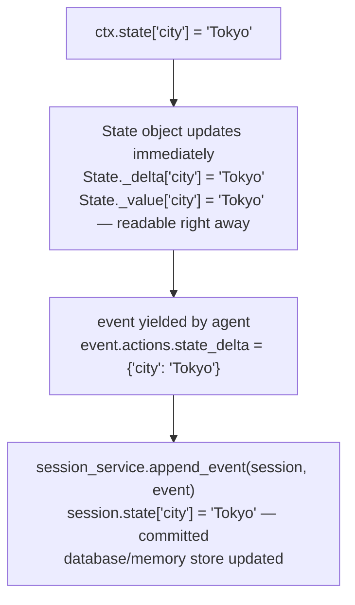
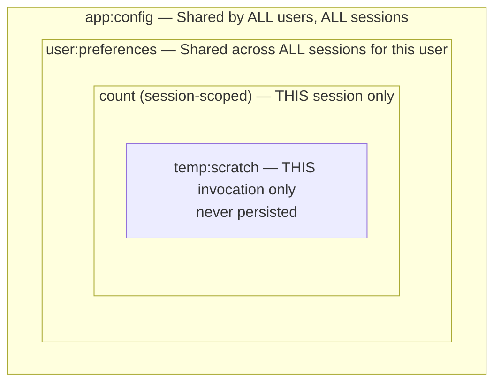

# 08 — Sessions: Conversation History & State

> **Official docs:** [Sessions](https://google.github.io/adk-docs/sessions/) | **Source:** [`sessions/session.py`](https://github.com/google/adk-python/blob/main/src/google/adk/sessions/session.py) · [`sessions/base_session_service.py`](https://github.com/google/adk-python/blob/main/src/google/adk/sessions/base_session_service.py) · [`sessions/in_memory_session_service.py`](https://github.com/google/adk-python/blob/main/src/google/adk/sessions/in_memory_session_service.py) | **Prereqs:** [03-runners.md](03-runners.md), [07-events.md](07-events.md)

## At a Glance



A `Session` is one conversation thread. It stores the full ordered list of `Event`s (conversation history) and a mutable `state` dict (arbitrary key-value data persisted across turns). `BaseSessionService` provides CRUD. Agents access sessions only through `InvocationContext`.

---

## Class Hierarchy



---

## Key API

### Session Data Model

```python
class Session(BaseModel):
    id: str # unique session ID
    app_name: str # which app this session belongs to
    user_id: str # which user owns this session
    state: dict[str, Any] # arbitrary persistent state (survives turns)
    events: list[Event] # full conversation history (ordered)
    last_update_time: float # unix timestamp of last update
```

Intentionally minimal. Complexity lives in the service and Event list.

### BaseSessionService — The Interface

```python
class BaseSessionService(ABC):
    async def create_session(
        self, *, app_name, user_id, state=None, session_id=None
    ) -> Session

    async def get_session(
        self, *, app_name, user_id, session_id, config=None
    ) -> Optional[Session]
        # config: GetSessionConfig(num_recent_events=..., after_timestamp=...)

    async def list_sessions(
        self, *, app_name, user_id=None
    ) -> ListSessionsResponse

    async def delete_session(
        self, *, app_name, user_id, session_id
    ) -> None

    async def append_event(
        self, session: Session, event: Event
    ) -> Event
        # Applies event.actions.state_delta to session.state.
        # Assigns event.id if not set.
        # Returns the persisted event.
```

`append_event` is called by `Runner` after every event yielded by the agent.

### GetSessionConfig — Partial Loading

Load only recent events for long conversations:

```python
config = GetSessionConfig(
    num_recent_events=50, # only last 50 events
    after_timestamp=1700000000.0, # only events after this unix time
)
session = await session_service.get_session(..., config=config)
```

Sessions have thousands of events but you only need recent context.

### Implementations

| Class | Storage | Use Case |
|-------|---------|----------|
| `InMemorySessionService` | Python dict | Development, tests |
| `SqliteSessionService` | SQLite file | Local persistence, single process |
| `DatabaseSessionService` | SQLAlchemy | Postgres, MySQL, production databases |
| `VertexAiSessionService` | Vertex AI managed | Cloud deployment with Vertex AI |

Same interface; swap backends by changing the `Runner` constructor argument.

For selection guidance (pros/cons, decision tree), see [20-best-practices.md](20-best-practices.md).

---

## How It Works

### How Runner Uses Sessions



### State Delta Lifecycle



### State Scope Visual



---

## Examples

### Session State

`session.state` is a free-form dict. Written via `EventActions.state_delta`:

```python
# In a tool or callback:
tool_context.state['user_name'] = 'Alice'
# → stored in event.actions.state_delta['user_name'] = 'Alice'
# → session_service applies the delta on append_event

# In LlmAgent:
agent = LlmAgent(output_key='summary')
# → final response text is saved to session.state['summary']
```

### State Scoping in Practice

```python
# Session-scoped (default) — only this session sees this:
tool_context.state['cart_items'] = [...]

# User-scoped — all sessions for this user see this:
tool_context.state['user:preferences'] = {'theme': 'dark'}

# App-scoped — every user in this app sees this:
tool_context.state['app:feature_flags'] = {'beta': True}
```

State is scoped:
- `'key'` — session-level (default)
- `'user:key'` — user-level (shared across all sessions for this user)
- `'app:key'` — app-level (shared across all sessions and users)

Scoping is handled by the session service implementations.

---

## Gotchas

- State deltas are only committed when `append_event` is called by the Runner — if you set state but the event is never appended, the change is lost.
- `GetSessionConfig` filters events on retrieval, not deletion — the full history still exists in storage.
- The `"user"` name is reserved by ADK; do not use it as a user_id.
- `temp:` prefixed keys are ephemeral and never persisted — useful for scratch data within a single invocation.

---

## Related

- [`sessions/session.py`](https://github.com/google/adk-python/blob/main/src/google/adk/sessions/session.py) — data model
- [`sessions/base_session_service.py`](https://github.com/google/adk-python/blob/main/src/google/adk/sessions/base_session_service.py) — abstract interface
- [`sessions/in_memory_session_service.py`](https://github.com/google/adk-python/blob/main/src/google/adk/sessions/in_memory_session_service.py) — default for dev
- [`sessions/sqlite_session_service.py`](https://github.com/google/adk-python/blob/main/src/google/adk/sessions/sqlite_session_service.py) — local persistence
- [`sessions/database_session_service.py`](https://github.com/google/adk-python/blob/main/src/google/adk/sessions/database_session_service.py) — production DB
- [`sessions/state.py`](https://github.com/google/adk-python/blob/main/src/google/adk/sessions/state.py) — state scoping constants
- [19-session-security.md](19-session-security.md) — Session event security considerations
- [18-session-lifecycle.md](18-session-lifecycle.md) — Session service call timeline and optimization
